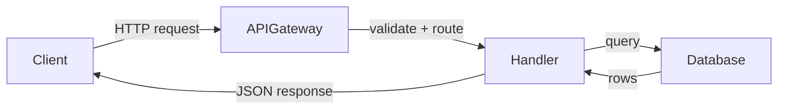

# Wiki 生成

读取仓库，然后生成一组相互关联的文档页面，解释代码的功能及其如何组合在一起。输出是一个名为`droid-wiki/`的目录，包含 markdown 文件，并通过`droid wiki-upload`上传到 Factory。

## 0. 解决基础 Wiki

在从零开始生成新 Wiki 之前，检查是否存在先前的 Wiki。如果存在且代码库变化不大，则仅重新生成最近更改影响到的页面（增量模式）。如果代码库有重大变更或不存在先前的 Wiki，则从零开始生成整个 Wiki（全量模式）。

### A. 找到现有的基础 Wiki

按以下顺序尝试这些来源：

1. **本地 Wiki 目录。**检查仓库根目录是否存在满足以下三个条件的 `droid-wiki/`：

   - 该目录包含至少一个 `.md` 文件
   - 存在一个 `.wiki-meta.json` 文件在里面
   - `.wiki-meta.json` 包含一个非空的 `commitHash` 字段

   如果这三个条件都满足，则使用 `droid-wiki/` 作为基础 Wiki。从 `commitHash` 中读取 `.wiki-meta.json` — 这是 Wiki 最后一次生成时的提交。

2. **远程 Wiki 历史记录。**如果不存在有效的本地 Wiki，请获取远程 Wiki 历史记录：

   ```bash
   droid wiki-read --repo-url <url> --json
   ```

   这返回一个包含之前 Wiki 运行的列表，每个运行都有 `wikiRunId`, `createdAt`, `branch`, `commitHash`, 和 `pageCount`。

   通过运行以下命令选择 `commitHash` 最接近当前 HEAD 的运行：

   ```bash
   git rev-list --count <wikiCommit>..HEAD
   ```

   对每个候选运行此命令，并选择距离最小的运行。

   将选定的运行材料化到临时目录中：

   ```bash
   WIKI_BASE_TMPDIR=$(mktemp -d)
   ```

   **枚举页面。** 使用 `--page` 选项获取完整的 Wiki 运行元数据以获得页面树：

   ```bash
   droid wiki-read --wiki-run-id <id> --json
   ```

   响应包括一个 `pageTree` — 一个递归结构，其中每个节点有 `pageId`, `title`, `path`, `order`, 和 `children`。从这个树中收集每一个 `pageId`.

   **下载每个页面。** 对于每个 `pageId`，获取其内容：

   ```bash
   droid wiki-read --wiki-run-id <id> --page <pageId> --json
   ```

   这会返回 `{ pageId, path, title, content }`。将 `content` 写入 `$WIKI_BASE_TMPDIR/<path>`，根据需要创建子目录（例如，使用 `mkdir -p` 创建每个路径的父目录）。

   **重构 `.wiki-meta.json`。** 远程 Wiki 没有 `.wiki-meta.json` 文件 — 您必须从 pageTree 构建它。按深度优先顺序遍历树，在每一级根据每个节点的 `order` 字段对子节点进行排序，并收集每个节点的 `path` 到一个 `pageOrder` 数组中。将包含 `.wiki-meta.json` 以及 Wiki 运行元数据中的 `$WIKI_BASE_TMPDIR` 和 `pageOrder` 的 `commitHash` 写入 `branch`。

3. **没有基础 Wiki 可用。** 如果既没有本地也没有远程 Wiki，请按照**完整模式**进行（跳过步骤 0 的剩余部分，直接进入标准的全面生成流程到步骤 1）。

### B. 计算差额

一旦你有了基础 Wiki 及其`commitHash`，计算自 Wiki 生成以来代码库发生了多少变化：

```bash
git diff --shortstat <wikiCommit> HEAD -- . ':!*.lock' ':!package-lock.json' ':!*.generated.*'
```

这会产生类似 `42 files changed, 1500 insertions(+), 300 deletions(-)` 的输出。将插入数和删除数相加，即可得到总变更行数。

**基于总修改行数的选择模式：**

| 总更改行数      | 模式             | 动作                                                                            |
| ------------------------ | ---------------- | --------------------------------------------------------------------------------- |
| `git diff` 命令失败 | FULL MODE        | 丢弃基础 Wiki 并从头生成                                   |
| > 10,000 行           | FULL MODE        | 丢弃基础 Wiki 并从头生成                                   |
| 0 行                  | SKIP             | 告诉用户 "Wiki 已经是最新版本" 并停止 — 不要进行步骤 1-5 |
| ≤ 10,000 行           | 增量模式 | 继续使用其增量模式子部分的步骤1-3                    |

### C. 边角情况处理

| 条件                                                                  | 动作                                                                 |
| -------------------------------------------------------------------------- | ---------------------------------------------------------------------- |
| `git diff` 失败（坏的提交哈希，浅克隆）                          | 回退到 FULL 模式                                                 |
| 本地存在 `droid-wiki/` 但没有 `.wiki-meta.json` 或没有 `commitHash` | 回退到远程历史以获取提交信息；如果不可用，则转为完整模式 |
| 本地存在 `droid-wiki/` 但没有 `.md` 文件                          | 视为没有本地 Wiki，尝试远程                                     |
| 远程 Wiki 获取失败（认证、网络、特性标志）                      | 回退到 FULL 模式                                                 |
| Wiki 是在不同的分支生成的                                   | 使用`git merge-base`找到共同祖先，从那里进行差异比较          |
| 差异数为0（HEAD == Wiki 提交，无本地更改）                         | 告诉用户 Wiki 是最新的，跳过生成                             |

## 1. 检查仓库

在写任何东西之前，构建代码库的思维模型。调查分为两遍：结构扫描和深入代码扫描

### Pass 1：结构扫描

阅读这些文件（当它们存在时）:

- `README.md`、`AGENTS.md`、`CONTRIBUTING.md` — 项目意图和约定
- `package.json`、`Cargo.toml`、`go.mod`、`pyproject.toml` — 依赖项和脚本
- `docs/` 目录 — 存在的文档
- 入口点 (`src/index.ts`, `main.go`, `app.py`, 等) — 应用程序启动方式
- CI/CD 配置 (`.github/workflows/`, `.gitlab-ci.yml`, `Jenkinsfile`, `azure-pipelines.yml`, 等)
- 构建工具配置 (`webpack.config.*`, `vite.config.*`, `Makefile`, `build/`, `Gulpfile.*`, 等)
- 代码检查/质量配置 (`eslint.config.*`, 自定义代码检查 plugin, `rustfmt.toml`, `.golangci.yml`, 等)
- 项目根目录及其关键子目录的目录列表

构建项目的地图：

- **项目做什么** — 一两句话描述其目的
- **主要子系统** — 代码库的主要区域 (例如，API 层、数据库模型、命令行界面、前端组件)
- **关键数据流** — 数据如何在系统中流动 (请求 → 处理器 → 数据库 → 响应)
- **外部依赖项** — 数据库、API、消息队列、第三方服务
- **构建和测试命令** — 如何构建、测试并运行项目

### Pass 2：深入代码扫描

结构化扫描会捕捉到通过目录名和配置文件可见的内容。深入扫描则会发现仅在代码本身中可见的功能、领域和能力。探测代码库以寻找结构化扫描遗漏的信号:

- 在常量文件中使用 Grep 查找 feature flag 名称——每个 flag 通常代表一个值得记录的独立功能。
- 扫描前端路由定义和页面组件 — 每个路由组是一个面向用户的特性
- 扫描 API 端点组 — 每个控制器或路由器文件代表一个领域区域
- 查看 `src/features/`、`src/modules/`、`src/domains/` 或等效目录内部 — 名称和内容揭示了产品能力
- 搜索服务类、事件处理器以及作业/工作者定义 — 这些揭示了后台系统
- 检查不明显映射到顶级名称的领域特定目录

目标是发现 **完整的主题列表**，Wiki 应该涵盖这些主题。结构化扫描给你提供了一个框架；深入扫描则填充了肌肉。例如，“分析”这一功能可能没有自己的顶级目录，但存在于 `src/features/analytics/` 中或通过一组功能标志和 API 端点揭示出来

### 详尽的子系统发现

在完成两步后，遍历每个顶层源代码目录（以及其下一级）以检查你遗漏的子系统。对于包含自身服务、模块或特性的每个目录，决定:

- **Tier 1** — 核心子系统，大多数贡献者都会遇到。完整独立页面。
- **Tier 2** — 重要但专门化。较短的专业页面。
- **Tier 3** — 小众或薄封装。其他子系统页面中的一个段落，带有目录指针。

小型仓库可能只需要几个领域页面。大型仓库应根据代码库的实际需求设置多个页面。不要随意限制——让仓库的实际结构决定覆盖范围。

### 经常被忽略的区域

在扫描源码树后，请检查这些常被忽略的区域：

- **自定义检查/分析规则** — plugin 或配置，用于强制执行项目特定的约定
- **自动化工作流** — CI/CD、机器人、计划任务、代码生成脚本
- **CLI 或开发工具** — 内部工具，`scripts/`、`tools/` 或 `bin/` 目录中的脚本
- **测试基础设施** — 自定义测试框架、测试用例或超出标准测试运行器的自动化工具
- **多语言组件** — 如果仓库中有第二种语言的代码（例如，TypeScript 项目中的 Rust CLI），请记录下来。

如果其中任何一个不简单，它们都值得被涵盖——要么作为独立的页面，要么作为相关页面中的一个部分。

### 调查输出

在调查结束时，生成一个 **调查上下文文档** — 一个紧凑的摘要，将与子 agent 共享。此文档应包括：

- **Repo 总结** — 3-5 句话：项目是什么、使用的技术栈以及高层次结构
- **架构概述** — 主要组件及其连接方式
- **发现的主题** — 扫描过程中找到的所有功能、系统、应用、包和原语的完整列表
- **关键模式** — 编码约定、错误处理模式、测试模式
- **术语种子** — 在扫描期间遇到的项目特定术语
- **目录-用途映射** — 哪些源目录对应于哪些主题

### 覆盖率交叉检查

在转向规划之前，将两个独立的主题来源进行核对以确保没有遗漏：

**来源 A: 发现的主题** — Pass 1（结构扫描）和 Pass 2（深入代码扫描）找到的跨切面功能。这些包括不映射到单一目录的功能（例如，“LLM 集成”跨越多个包，“认证”触及前端、后端和 CLI）。

**来源 B: 目录枚举** — 对于适用于该仓库的每个视角，运行 `ls` 命令在相应的源目录上并列出所有子目录：

- 对于应用：列出 `apps/`（或等效目录）下的所有目录
- 对于包：列出每个工作空间包目录
- 对于功能：列出功能目录下的子目录（例如，`src/features/`、`packages/frontend/src/features/` 或者仓库组织功能的地方）
- 对于系统：列出包含服务或模块代码的顶级源目录

**核对：** 合并两个列表。对于每个列表中的每一项，决定：

1. **Wiki 页面** — 该项成为计划中的页面（或页面内的部分）
2. **跳过并说明原因** — 该项故意被排除在外，并附有具体理由（例如，“空目录——0 个源文件”，“弃用——仅剩测试示例”，“薄包装器——已包含在父包页面中”，“内部工具——3 个文件，不值得单独的页面”）

发现的主题捕捉到目录遗漏的内容（跨切关注点、新兴模式）。目录枚举捕捉到发现遗漏的内容（功能 agent 在其读取的文件中未遇到的功能）。两者一起产生全面覆盖。

沉默的省略不可接受。如果存在非平凡代码的源目录但没有 Wiki 主题，这必须得到解释。

### 增量模式

在增量模式下（选择了 INCREMENTAL MODE 步骤 0），跳过整个仓库的完整结构扫描和深入代码扫描。相反：

1. 运行 `git diff --stat <wikiCommit> HEAD` 获取更改过的文件和目录列表
2. 阅读现有的基础 Wiki 页面以理解当前的结构和覆盖范围
3. 仅调查代码库中更改的目录和文件——阅读其源代码以了解发生了什么变化
4. 使用 `ls` 命令列出所有顶级源目录，并与现有 Wiki 页面覆盖范围进行比较，以捕获差异本身无法揭示的新子系统
5. 检查是否有任何已文档化的源路径不再存在（已被删除的子系统需要移除其 Wiki 页面）

**输出**：一个限定范围的调查上下文，包括差异摘要、受影响的 Wiki 页面列表、需要新增页面的新区域以及需要移除页面的区域。这在增量模式下取代了完整的调查上下文文档

## 2. 规划目录结构

在撰写任何文字之前先设计页面树。Wiki 有三层内容：始终存在的页面、组织性视角和条件性部分

### 始终存在的页面

这些页面在每个 Wiki 中都出现，顺序如下：

1. `overview/` — 统一在一个部分下的入门材料
   - `index.md` — 项目概述：它做什么，谁使用它，快速链接
   - `architecture.md` — 系统架构带有 Mermaid 图表
   - `getting-started.md` — 先决条件、安装、构建、测试、运行
   - `glossary.md` — 项目特定术语和领域词汇
2. `by-the-numbers.md` — 代码库统计快照（参见下方）
3. `lore.md` — 代码库的时间线和历史（参见下方）
4. `how-to-contribute/` — 如何在该代码库中工作
   - `index.md` — 工作领取，PR 流程，审查期望，完成定义
   - `development-workflow.md` — 分支，代码，测试，PR，合并周期
   - `testing.md` — 框架，模式，如何运行，模拟和覆盖
   - `debugging.md` — 日志，常见错误，故障排除手册
   - `patterns-and-conventions.md` — 错误处理，编码风格，横切关注点
   - `tooling.md` — 构建系统，检查器，代码生成器，CI 工具（如果仓库的工具是产品本身，则将此部分提升为顶级部分）

### 数据概览

创建一个顶级 `by-the-numbers.md` 页面，提供代码库的定量快照。页面开头注明“数据收集于 [日期]”，让读者了解这些数字的时效性。

包括这些部分：

- **规模** — 按语言统计代码行数（使用 Mermaid 水平条形图）、源文件/测试文件/配置文件总数，以及 monorepo 中的包/模块数量
- **活跃度** — 每周/每月提交次数（近期趋势），以及过去 90 天内变更最活跃的文件/目录（变更热点）
- **机器人参与的提交** — 由机器人共同署名的提交占比（例如，`Co-authored-by: factory-droid[bot]`、`dependabot[bot]`、`github-actions[bot]`、`copilot[bot]`）。这是 AI 辅助工作的下界，因为 Copilot 等内联 AI 工具不会在 Git 历史中留下痕迹。应明确说明统计口径
- **复杂度** — 各目录的平均文件大小、最深导入链，以及每个包导出的符号数量

使用 Mermaid `xychart-beta`（水平条形图）进行语言分解和其他任何统计数据，其中可视化有助于理解。请勿使用 Mermaid `pie` 图表——它们不受渲染器支持。对于文件/目录列表，请使用表格。

**绝不要包含单个贡献者的统计数据**（提交者排名、个人代码行数、排行榜）。数据概览页关注的是代码库，而不是个人。个人指标会制造有害比较，不适合团队文档；所有权映射由 `maintainers.md` 页面单独处理。

**在其他页面内嵌统计信息：**除本摘要页外，还要把相关统计信息自然地融入现有页面：

- 语言分解在 `architecture.md` 中
- 变更热点在 `cleanup-opportunities/`（如果该部分存在）
- 文件计数、单点失效（唯一提交者）、每个子系统中的测试与代码比率在每个领域页面上
- 依赖项计数在 `reference/dependencies.md` 中

### 项目轶事

一个顶级的 `lore.md` 页面，讲述代码库演变的故事。这是一部叙述性历史，而不是技术参考。它回答了‘这里发生了什么以及何时发生？’

**与其他部分的边界：**

- `by-the-numbers.md` = 当前快照（代码库现在的样子）
- `lore.md` = 时间线和历史（变化及其时间）
- `fun-facts.md` = 轻松 trivia（复活节彩蛋、有趣的发现）
- `background/` = 技术理由（为什么做出这些决定）

**每个事件、时代和里程碑都必须包含日期或月份**（例如，“Mar 2023”，“Q4 2024”）。从 git 提交时间戳、标签日期和文件创建日期推导日期。如果无法获得确切的日期，请使用最早的相关提交的月份。

包括这些部分：

- **时代** — 将代码库历史划分为 3-8 个主要阶段，每个阶段都包含简短的叙事说明和关键事件要点。根据 git 历史推导：标签日期、大型 merge commit、贡献者模式和目录创建日期。示例：“TypeScript 迁移（Mar–Aug 2023）：整个后端在 5 个月内从 JavaScript 重写为 TypeScript...”
- **最持久的功能** — 经受最多重构且仍然活跃使用的代码或子系统。包括它们首次引入的时间以及它们经历了多少次更改。
- **弃用的功能** — 建造、使用然后移除或替换的东西。从目录名称、README 提到的内容、明显的 `@deprecated` 注释和删除的路由中识别。该功能是什么，它何时被引入，何时被弃用，以及什么替代了它。
- **重大重写** — 涉及多个文件的大规模更改。说明原先存在什么、被什么取代，以及何时发生。根据 Git 历史推导（大型 PR、名称中包含“迁移”或“重写”的分支）。
- **增长轨迹** — 代码库如何随时间扩展：何时添加了包/应用，以及 Git 日志中的贡献者增长信号。

**推测：**当提交记录未明确说明更改背后的原因时，使用自然、审慎的措辞（如“似乎是为了”“很可能是因为”）。推测内容无需特殊格式。

### 组织视角

有五种视角可用于组织代码库的深入研究。根据仓库实际内容选择任意组合，至少使用一种；大多数仓库使用 2-3 种。强烈建议采用**功能**视角——这是新工程师最直观的入口（“这个东西做什么？”）。即使是小型仓库，通常也有值得记录的用户可见或开发者可见功能。仅当仓库是没有独立功能的单用途库时才跳过。

| 概念                     | 默认标签   | 也称为                                     | 何时使用                                                                 |
| --------------------------- | --------------- | ----------------------------------------------- | --------------------------------------------------------------------------- |
| 可部署单元            | `applications/` | `services/`, `apps/`                            | 仓库分发多个独立运行时                                       |
| 内部构建块    | `systems/`      | `services/`, `modules/`, `subsystems/`          | 不对应单一应用或包的架构组件          |
| 横切能力  | `features/`     | `capabilities/`, `workflows/`                   | 跨越多个系统的用户可见或开发者可见事物         |
| 工作区包          | `packages/`     | `libraries/`, `crates/`, `modules/`             | 包含值得单独记录的共享库的一体仓库               |
| 基础领域对象 | `primitives/`   | `core-concepts/`, `domain-models/`, `entities/` | 在3 个及以上系统中出现的类型/概念（例如，会话、用户、消息） |

**选择标签规则：** 在镜像仓库自身词汇。如果仓库有 `apps/` 目录，称该部分为 `apps/` 而不是 `applications/`。如果仓库称呼事物为“服务”，使用 `services/`。默认标签是当仓库没有现有惯例时的备选方案

**放置规则：**

- 将每个概念放在仓库结构暗示它应归属的地方。如果 agent 逻辑位于 `packages/droid-core`，则在 packages 下记录它，而不是 systems 下
- 系统视角用于那些不自然归属于应用或包的事物——新兴架构模式、跨包系统、跨越多个目录的基础设施
- 不要在不同视角中重复内容。如果某事物已在 packages 下记录，则相关应用页面应提供交叉链接而非重复内容

**识别每个透镜的启发式规则：**

- 如果它有自己的入口点和部署方式，那么它是**应用**
- 如果是其他包导入的工作区包，那么它是**包**
- 如果是具有内部逻辑和清晰边界但不对应单一包的模块，那么它是**系统**
- 如果它是出现在3+个系统中的类型或概念，那么它是**原始类型**
- 如果理解它需要追踪多个系统或应用，那么它是**特性**

### 条件部分

根据审阅仓库后的判断包括这些内容。不适用的部分可以跳过。

- `api/` — 如果仓库暴露了 REST、GraphQL、WebSocket 或其他 API
- `deployment/` — 如果有非平凡的部署过程（CI/CD、环境、回滚、基础设施）
- `security/` — 如果有关于信任边界的有意义考量（认证、授权、密钥、输入验证）
- `background/` — 如果仓库有有意义的历史（设计决策、陷阱/危险区域、迁移上下文）
- `how-to-monitor/` — 如果仓库作为服务运行，并具有日志记录、指标、跟踪或告警基础设施
- `cleanup-opportunities/` — 如果仓库包含死代码、累积的 TODO/FIXME、过大文件或过时依赖项。仅在实际有内容可报告时包括（参见下方）
- `fun-facts.md` — 暗示、起源故事、最古老的代码、命名来源

### 如何监控

此条件部分记录了查看系统正在做什么的方法。仅在仓库作为具有日志记录、指标或跟踪基础设施的服务运行时生成它。对于库、命令行工具或包不适用。

子页面：

- `logging.md` — 日志文件的位置，如何查询它们，日志级别和约定，结构化日志模式，如何添加新的日志语句
- `metrics.md` — 跟踪哪些指标，关键 SLIs/SLOs，可用仪表板，如何添加新指标
- `tracing.md` — 分布式跟踪设置，如何端到端地跟踪请求，跨度命名约定，如何对新代码路径进行计时器化
- `alerting.md` — 存在哪些告警，告警阈值和理由，升级路径，已知嘈杂的告警，如何添加新的告警

跳过仓库没有相应基础设施的任何子页面。如果只有一个子页面有内容，则将 `how-to-monitor/` 合并为单个 `how-to-monitor.md` 文件而不是目录。

### 清理机会

此条件部分显示可操作的维护工作。仅在扫描发现有意义的内容时生成它。可能的子页面:

- `dead-ends.md` — 文件、导出或模块，没有任何内容导入。代码等同于鬼镇。
- `todos-and-fixmes.md` — 累积的 TODO, FIXME 和 HACK 评论及其文件位置。包括最古老的那些。
- `complexity-hotspots.md` — 最大的源文件、最深的嵌套或最复杂的函数。这是一个轻柔地推动重构的提示。
- `dependency-freshness.md` — 过时或未维护的依赖项。仍在使用的最古老依赖项。

跳过任何没有发现结果的子页面。如果只有一个子页面有内容，则将 `cleanup-opportunities/` 合并为一个单独的 `cleanup-opportunities.md` 文件，而不是目录。

### 维护者

包含一个顶级的 `maintainers.md` 页面，该页面将子系统映射到了解它们的人。此页面使用两种数据源:

- **CODEOWNERS 文件**（如果存在）——官方的所有权分配
- **Git blame / git log** — 每个目录或子系统的最近或最频繁的2-3 位提交者

以表格形式呈现:

```markdown
| Subsystem      | Official owners (CODEOWNERS) | Recent contributors (git history) | Last activity |
| -------------- | ---------------------------- | --------------------------------- | ------------- |
| Authentication | @alice                       | alice, bob                        | 2 weeks ago   |
| CLI            | @charlie, @dave              | charlie, eve                      | 3 days ago    |
```

如果仓库没有 CODEOWNERS 文件，则省略该列，并从 Git 历史记录中推导所有数据。如果仓库很少有贡献者（例如，单人项目），则完全跳过此页面。

### 每页活跃贡献者

每个领域页面（应用程序、系统、功能、包、原语）应在页面标题之后的第一行包含一个“活跃贡献者”副标题，紧接着目的部分之前：

```markdown
# Authentication

Active contributors: alice, bob

## Purpose

...
```

从 CODEOWNERS（如果可用）中提取名称，并与该子系统的目录中最近的2-3 位提交者的姓名或 GitHub 用户名合并。使用名字或 GitHub 用户名，不带@符号。

**排除机器人账户**——过滤掉以 `[bot]` 结尾的用户名（例如 `factory-droid[bot]`, `dependabot[bot]`, `github-actions[bot]`）。机器人不是你可以用来提问的人。这适用于每页活跃贡献者副标题和维护者页面。

**使用默认分支作为贡献者数据**——从 git blame 或 git log 中提取贡献者时，始终针对默认分支（`main` 或 `dev`）查询，而不是当前分支。功能分支会使贡献者数据偏向于在该分支上工作的人员。使用 `git log origin/main -- <path>` 或 `git log origin/dev -- <path>` 获取准确的贡献者历史记录。

### 底部部分

这些内容出现在每个 Wiki 页面的末尾：

- `reference/` — 配置、数据模型、外部依赖项
- `maintainers.md` — 子系统所有权表（条件性，独占项目跳过；始终是最后一页）

### 页面排序

侧边栏的排序对于导航至关重要。每个页面必须出现在其定义的位置——不要将无子页的页面一起放在顶部或底部。

Wiki 中的完整排序为：

1. overview/（index、architecture、getting-started、glossary）
2. by-the-numbers.md（如果存在）
3. lore.md（如果存在）
4. fun-facts.md（如果存在）
5. how-to-contribute/
6. [组织视角，按合理顺序]
7. [条件部分：api、deployment、security、how-to-monitor、background、cleanup-opportunities]
8. reference/
9. maintainers.md（如适用，始终最后）

**排序规则:**

- 每一页都保持其定义的位置，无论是否有子页面。`by-the-numbers.md`出现在`overview/`之后，即使它没有子页面，也不在顶部与其他无子页面的页面一起出现。
- `pageOrder` 中的 `.wiki-meta.json` 数组必须严格按照此顺序排列。它控制侧边栏的显示顺序。
- 在透镜部分（例如，`apps/`）中，按重要性从高到低排列页面。`index.md` 总是排第一。
- 条件部分按照上述顺序出现（api → deployment → security → how-to-monitor → background → cleanup-opportunities），而不是按字母顺序排列。

### 嵌套规则

- 任何页面都可以扩展为包含子页面的目录，除了 `overview/` 目录内的四个页面 (`index.md`, `architecture.md`, `getting-started.md`, `glossary.md`)，它们总是单个文件。
- 最大深度：从任何透镜根开始的2 级（例如，`apps/cli.md` 或 `apps/cli/index.md` + `apps/cli/tui-rendering.md`）。不再深入。
- 每个目录必须包含一个 `index.md`
- 对于大型仓库（50+ 代码目录或 10+ 独立子系统），倾向于拆分页面而不是挤在一个大页面里。一个涵盖整个子系统的 3000 字页面不如三个专注于其不同方面的页面有用。关键的子 agent 根据他们在代码中发现的内容决定是否创建子页面。
- 对于小型仓库，默认使用单个页面，只有当主题有明显不同的子区域时才进行拆分
- 部署和安全开始为单个页面；如果仓库有足够的内容，则扩展到目录

### 命名规则

- 使用小写文件名并用连字符连接：`getting-started.md`，而不是 `GettingStarted.md`
- 文件名使用小写字母和连字符，不包含空格或大写字母。

### 页面标题规则

页面标题（每个 `# Heading` 文件顶部的 `.md`）应简洁且符合团队对事物的称呼。段落层次结构已经提供了上下文，因此标题不应重复这些内容。

- **不要前置目录路径。** 标题是 "CLI"，而不是 "apps/cli — CLI 架构"。
- **不要添加通用后缀。** 标题是 "Apps"，而不是 "Apps 概览"。标题是 "Packages"，而不是 "Packages — 概览"。唯一的例外是 `overview/index.md` 可能包括项目名称（例如，"Factory 平台概览"）。
- **不要重复父段落名称。** 位于 `features/sessions.md` 的页面标题为 "Sessions"，而不是 "Features — Sessions"。
- **匹配团队的词汇。** 如果团队称之为 "守护进程"，则标题是 "Daemon"，而不是 "后台服务进程"。
- **保持简短。**目标为1-3 个词。如果标题需要更多内容，可能页面覆盖范围过多，应被拆分。

### 增量模式

在增量模式下，从现有 TOC（来自基础 Wiki 的 `.wiki-meta.json` `pageOrder`）开始，而不是从头设计页面树。只需计划更改：

- **要更新的页面** — 基础代码发生变化（通过范围化的调查识别出）的页面
- **要创建的新页面** — 自上次 Wiki 生成以来添加的新子系统或功能所需的新的页面
- **要移除的页面** — 被删除且其 Wiki 页面应被移除的子系统
- **保持不变的页面**——源代码未发生变化的页面；这些页面将从基础 Wiki 中原封不动地复制过来

特殊页面规则：

- `by-the-numbers.md` 应始终刷新 —— 它依赖于自上次生成以来 git 历史和代码库统计的变化情况
- `lore.md` 只有当差异足够大以值得新增历史条目时才应被刷新。根据变更的性质判断——重大重写或新子系统需要更新，而小错误修复则不需要

## 3. 生成页面（使用子 agent 委派）

页面生成使用顶级 agent 进行编排和基础页面生成，然后将领域页面委派给子 agent 以实现深度和并行性。

### 执行有向无环图 (DAG)

```
1. SURVEY (top-level)
   Structural scan + deep code scan
   Produce: survey_context
        │
        ▼
2. PLAN (top-level)
   Decide lens sections, list all pages, mark criticality
   Produce: page_plan (JSON with per-page briefs)
        │
        ▼
3. FOUNDATION PAGES (top-level, sequential)
   Write: overview/*, how-to-contribute/patterns-and-conventions
   These establish shared vocabulary and conventions
        │
        ├────────────────────────────────────────┐
        ▼                                        ▼
4a. LENS PAGES (sub-agents, parallel)     4b. DATA PAGES (sub-agents, parallel)
    Critical pages: 1 agent each               by-the-numbers
    Normal pages: batched 3-5                  lore
    Each agent writes its page(s)              fun-facts
    + sub-pages if warranted
        │                                        │
        ├────────────────────────────────────────┘
        ▼
5. REMAINING PAGES (sub-agents, parallel)
   how-to-contribute/ (remaining pages)
   Conditional sections: api, deployment, security,
     how-to-monitor, background, cleanup-opportunities
   reference/ + maintainers.md
        │
        ▼
6. ASSEMBLY (top-level)
   Cross-link audit, .wiki-meta.json
        │
        ▼
7. UPLOAD
```

### 步骤2：规划与委派

在调查之后，顶级 agent 会生成一个 **页面计划** —— 一个包含每个页面的结构化列表。对于每个页面，该计划包括：

- **路径** — 文件路径（例如 `apps/cli/index.md`）
- **标题** — 页面标题
- **重要性** — `critical`（获得专门的子 agent）或 `normal`（与相关页面批量处理）
- **内容概要** — 2-3 句话描述页面应涵盖的内容以及需要阅读的代码路径
- **相关源码路径** — 子 agent 应该读取的具体文件/目录
- **相关页面** — 其他正在撰写的页面的标题、路径和简短总结，以便 agent 知道链接到这些页面而不是解释它们

**重要性指南：** 涵盖具有大型代码库、高变更率或核心架构角色的应用程序、包或功能的页面是设置专用 agent 的强大候选者。示例：包含 50 多个源文件的 CLI、被大多数其他包导入的核心库、跨越 5 个以上目录的功能。agent 根据调查使用其判断 — 这些是指导方针，不是硬性规定

**子 agent 深度指南**：单个页面不应试图从头到尾涵盖一个复杂的子系统。当以下情况之一发生时，子 agent 应创建子页面：

- 该子系统有 3 个及以上清晰区分的内部区域（例如，一个 CLI 包含 TUI 渲染、执行模式、skill 系统和会话管理 — 每个都值得单独一页）
- 单个页面需要超过约 2000 字才能充分涵盖主题
- 该子系统有多个入口点或不同的用户界面模式

何时拆分示例：

- 一个包含 50 多个源文件和 4000 多行入口点的 CLI 应用程序 → 每个主要子系统的单独页面（例如，`cli/tui-rendering.md`、`cli/exec-mode.md`、`cli/skills.md`、`cli/session-management.md`）
- 一个具有不同 API 组、认证系统和作业运行器的后端 → 每个都设置为单独一页
- 一个包含 10 多个功能模块的前端包 → 最复杂的那些模块设置为单独一页

示例（不拆分）:

- 一个包含5 个文件且单一用途的工具包 → 一页
- 一个简单的微服务，只有一个处理器 → 一页
- 配置或常量包 → 一页

### 第3 步: 基础页面

顶级 agent 在任何子 agent 运行之前按顺序编写这些页面:

1. `overview/index.md` — 项目概述
2. `overview/architecture.md` — 系统架构（使用 Mermaid 图表）
3. `overview/getting-started.md` — 先决条件、安装、构建、测试和运行
4. `overview/glossary.md` — 项目特定术语
5. `how-to-contribute/patterns-and-conventions.md` — 编码模式和约定

这些页面建立供子 agent 引用的共享词汇表和架构上下文。开始委派前，必须先完成这些页面。

### 步骤 4：子 agent 委派（并行）

两个小组的子 agent 并行运行：

**4a. 镜像页面** — 所有的组织镜像页面（应用、系统、功能、包、原语）:

- **关键页面**各分配一个专用子 agent。子 agent 阅读相关代码、编写页面，并自主判断是否需要子页面。如果某个主题明显包含不同子领域，agent 可以创建子页面（最多 2 级：`section/page.md`）。顶层 agent 不预先规划关键页面的子页面，由子 agent 探索后决定。
- **普通页面**按相关性分组，每个子 agent 批量处理 3-5 个页面（例如同时处理 3 个小型 package 或 2 个相关 feature）。批量页面通常都是不含子页面的单个文件。

**4b. 数据页面** — 镜像页面并行运行，因为它们只需要 git 历史和源文件结构：

- `by-the-numbers.md`
- `lore.md`
- `fun-facts.md`

### 步骤 5：剩余页面（并行）

所有镜像页面完成后，为以下内容启动子 agent：

- `how-to-contribute/` 剩余页面（开发工作流、测试、调试、工具）作为一个批次
- 每个条件部分各自分配一个子 agent 或小批次：api、部署、安全、如何监控、背景、清理机会
- `reference/` + `maintainers.md` 作为一个批次

这些页面现在可以相互引用，因为它们已经完成。

### 步骤 6: 组件组装

顶级 agent 进行最终检查：

- 审核页面之间的交叉链接（修复断链，添加缺失的链接）
- 验证所有内联代码文件引用都使用完整的仓库根路径（而不仅仅是文件名），以确保渲染后的源代码链接指向有效的 URL
- 编写 `.wiki-meta.json` 文件，包含最终的页面列表和排序
- 验证所有目录都有 `index.md` 文件

### 子 agent 提示词模板

每个子 agent 接收具有以下结构的提示词：

```
You are writing wiki page(s) for [repo].

## Shared Context
[The survey_context document from Step 1 — compact repo overview,
architecture, key patterns, glossary terms. Same for all agents.]

## Your Assignment
Pages: [list of pages this agent is responsible for]
Criticality: [critical or normal]
Content brief: [2-3 sentences per page describing what to cover]
Relevant source paths: [specific files/directories to read]

## Related Pages (link to these, don't duplicate their content)
- apps/cli (apps/cli/index.md): "CLI architecture, entry points, and TUI rendering"
- features/llm-integration (features/llm-integration.md): "LLM provider abstraction and streaming"
- ...

## Rules
- Follow the page template (sections 3a-3e in the skill)
- Maximum nesting: 2 levels (section/page.md)
- For critical pages: explore the code and create sub-pages if the topic
  has clearly distinct sub-areas. Write both the index.md and sub-pages.
- For normal pages: write single-file pages unless complexity demands splitting
- Use Mermaid diagrams when they help explain data flows or component relationships
- Cross-link to related pages listed above instead of re-explaining their topics
- Write output to [wiki_dir path]
```

所有 agent 使用相同的**共享上下文**，即精简的调研文档。顶层 agent 在规划阶段为每个页面定制**单页简报**。这样既能避免子 agent 重复发现调研中已有的信息，也能避免某个子 agent 解释其他页面负责的内容。

对于每个页面：

### 3a. 阅读相关代码

打开并阅读当前章节对应的实际源文件。不要猜测或虚构文件内容。如果文件过大，只阅读当前部分所需的内容。

### 3b. 写散文

用通俗的语言解释代码的功能。从高层次的目的开始，然后深入具体细节。每个断言都应该可以追溯到特定的文件或函数。

每个领域页面应包含这些部分（跳过不适用于子系统的部分）：

0. **活跃贡献者** — 在标题后立即添加一行简短的作者说明（参见第2 节中的“每页活跃贡献者”），
1. **目的** — 该子系统做什么，用2-3 句话描述
2. **目录布局** — 显示关键文件和文件夹的文件树
3. **重要抽象** — 表格列出最重要的类型（类、接口、特质、结构体、函数）及其文件路径以及一行描述
4. **如何工作** — 主要的数据/控制流，如果涉及3 个及以上组件，则使用 Mermaid 图示
5. **集成点** — 该子系统与其他部分的连接方式（它导入什么、被谁调用、发出或监听哪些事件）
6. **修改入口点** — 2-3 句话告诉开发人员从哪里开始，如果需要更改或扩展此子系统

根据子系统的复杂性来决定页面长度。一个简单的包装器可能只需要第1 节、第3 节和第5 节。复杂的子系统可能需要所有六节并包含多个图示。

### 3c. 添加 Mermaid 图示

使用 Mermaid 图表来说明:

- **Architecture** — 系统组件及其连接方式
- **Data flows** — 请求生命周期、事件管道、处理阶段
- **State machines** — 认证流程、订单状态、构建管道

Mermaid 图表指南:

- 使用 `graph TD` 或 `graph LR` 用于架构和流程图
- 使用 `sequenceDiagram` 用于服务之间的请求/响应流
- 使用 `stateDiagram-v2` 用于状态机
- 保持图表聚焦 — 最多 5 到 15 个节点。将较大的图表拆分为多个较小的图表
- 用动作或传递的数据标记边
- 使用子图来分组相关组件

示例:

````markdown

````

不要使用 Mermaid 来表示可以通过一句话解释的简单关系。图表应该通过展示难以用文字描述的内容来证明其存在价值。

### 3d. 添加文件引用

每个领域页面必须包含一个 **“关键源文件”** 表，列出该子系统最重要的文件：

```markdown
| File                        | Purpose                                        |
| --------------------------- | ---------------------------------------------- |
| `src/auth/middleware.ts`    | Validates JWT tokens, attaches user to request |
| `src/auth/token-service.ts` | Token creation, refresh, and revocation        |
```

表格应涵盖所有重要的文件——不要添加无关紧要的文件，也不要因为文件较少而省略某些文件。

在提及文件时，请参考其路径。首次提及类、接口、函数或类型时，在反引号中包含其文件路径。始终使用 **从仓库根目录开始的完整路径**（例如：`apps/backend/src/auth/middleware.ts`，而不是 `middleware.ts`）。这些路径将被渲染为可点击的源代码链接，简短的文件名而没有目录路径会产生断链。读者应该能够通过一步从文档跳转到代码。

### 3e. 相互链接页面

使用相对 Markdown 链接在页面之间进行相互链接：

```markdown
For details on how the auth middleware integrates with the API layer,
see [API authentication](../api/authentication.md).
```

每个页面至少应链接到另一个页面。读者应该能够在不使用侧边栏的情况下浏览 Wiki。

### 3f. 有趣事实内容

`fun-facts.md` 页面是可选的，但鼓励添加。从以下列表中选择特定仓库中最有趣的3-5 个主题：

- **最古老的存活代码** —— 使用 git blame 找到最古老的文件或函数。它有多古老？它的变化有多大？
- **依赖考古学** —— 最古老的仍在使用的依赖项，或者版本更新最多的那个
- **命名起源** — 项目或其内部工具为什么被命名为当前名称？工程师们给事物起名字很奇怪，通常背后都有一个故事
- **TODO/FIXME 计数** — 存在多少个 TODO/FIXME/HACK 注释？最古老的一个是哪个？
- **最长的文件** — 哪个源文件行数最多？这是一个温和的提示，同时也是一条重构线索

并非所有这些内容都需要放入每个 Wiki 中。只选择仓库中有真正有趣信息的部分。如果没有任何突出的内容，则可以完全跳过趣味事实部分

### 增量模式

在增量模式下，请使用复制和更新策略而不是从头生成所有页面:

1. **直接复制未更改的页面** 从基础 Wiki 位置（本地 `droid-wiki/` 或步骤0 中的临时目录）到输出 `droid-wiki/` 目录，不要重新生成这些页面
2. **仅为需要更新或创建的页面委派子 agent**。子 agent 接收相同的共享上下文以及步骤1 中提供的范围调查上下文和现有页面内容（以便它们可以保留结构并只修改更改的部分）
3. **移除页面**，这些页面已被计划（步骤2）标记为删除——不要从基础 Wiki 复制它们到输出目录。
4. **清理临时目录** — 如果基础 Wiki 是从远程获取的（在步骤0 中创建的临时目录），则在所有页面被复制或重新生成后删除它

## 第3.5 阶段：视觉捕获（QA 驱动的截图）

此阶段在内容生成和索引最终确定（第3 阶段）之后，但在最终总结（第4 阶段）之前运行。从运行的应用程序中捕获屏幕截图，并将其嵌入 Wiki 页面中，以提供与文本文档并行的视觉上下文

**此整个阶段是可选的。** 如果缺少任何先决条件，请以警告信息跳过该阶段并继续进行第4 阶段。将所有警告收集到一个列表中，并将其包含在第4 阶段总结中。

### 步骤3.5.1：检查先决条件

在尝试任何捕获之前，请验证以下内容中的所有项。如果任何检查失败，请以警告信息跳过此整个阶段。

**1. QA skill 是否存在：**

```bash
test -f .factory/skills/qa/config.yaml && echo "QA config found" || echo "SKIP: No QA config"
```

如果不存在`.factory/skills/qa/config.yaml`，请通知用户:`"Phase 3.5 requires a QA skill. Run /install-qa to set one up, then re-run the wiki generation."`并跳过此整个阶段（继续进行第4 阶段）。

**2. 工具可用性：**

检查所需的捕获工具是否已安装:

```bash
command -v agent-browser && echo "agent-browser available" || echo "WARN: agent-browser not found"
command -v tuistory && echo "tuistory available" || echo "WARN: tuistory not found"
```

- 如果`agent-browser`不可用，请跳过所有网页/桌面应用的捕获。添加警告:`"Web/desktop screenshots skipped: agent-browser not installed"`。
- 如果`tuistory`不可用，请跳过所有 CLI/TUI 的捕获。添加警告:`"TUI snapshots skipped: tuistory not installed"`。
- 如果两种工具都缺失，请以警告信息跳过整个阶段: `"Phase 3.5 skipped: neither agent-browser nor tuistory is available"`，然后继续进行第4 阶段。

**3. 可发现的应用：**

读取`.factory/skills/qa/config.yaml`并解析`apps`部分。每个应用条目可能包括:

- `dev_command` — 如何启动应用的开发服务器
- `port` — 应用监听的端口
- `test_tool` — `agent-browser` (适用于 web/桌面) 或 `tuistory` (适用于 CLI/TUI)
- `skill` — 与测试流程相关的子 skill 引用 (例如，`qa-web`)

筛选出同时具有 `dev_command` 和相应可用工具（web 应用为 `agent-browser`，CLI 应用为 `tuistory`）的应用。如果没有应用通过此筛选，则跳过该阶段并发出警告：`"Phase 3.5 skipped: no apps with dev_command and available capture tool found"`.

### 步骤 3.5.2: 启动开发服务器

对于每个通过前置检查的应用:

1. **检查服务器是否已运行**，可以通过击中其健康端点或端口来完成:

   ```bash
   curl -sf http://localhost:<port>/ >/dev/null 2>&1 && echo "Already running" || echo "Need to start"
   ```

2. **如果未运行，则使用应用的 `dev_command` 从 QA 配置启动开发服务器**:

   ```bash
   # Run in background, capture PID for cleanup
   nohup <dev_command> > /tmp/wiki-capture-<app_name>.log 2>&1 &
   DEV_PID=$!
   echo "Started <app_name> dev server (PID: $DEV_PID)"
   ```

3. **等待就绪状态**，通过轮询端口进行重试:

   ```bash
   for i in $(seq 1 30); do
     curl -sf http://localhost:<port>/ >/dev/null 2>&1 && break
     sleep 2
   done
   ```

   如果服务器在 60 秒内仍未就绪（30 次重试 \xD7 2s），请添加警告：`"Screenshots for <app_name> skipped: dev server failed to start on port <port>"`，并跳过该应用。不要中止整个阶段；继续处理其他应用。

4. **跟踪所有已启动的 PIDs** 在一个列表中以便在步骤 3.5.7 中清理

### 步骤 3.5.3：认证（Web/桌面应用）

对于需要认证的 web/桌面应用，使用 QA 配置中的角色定义进行登录：

1. 查找 `.factory/skills/qa/config.yaml` 文件中的角色部分。找到一个适合屏幕截图捕获的角色（通常是一个已有数据的角色）。注意其 `email`, `auth_method`, `credentials_source`, 和 `secret_name` 字段。

2. **获取凭证**:

   从角色配置的 `credentials_source` 字段确定如何获得密码。常见模式：

   - `env_var`: 从 `secret_name` 指定的环境变量中读取
   - `secrets_manager`: 从配置的秘密后端检索

   ```bash
   # Example: credentials sourced from an environment variable
   QA_PASSWORD="\${!SECRET_NAME:-}"
   ```

   如果凭证不可用，请添加警告: `"Screenshots for <app_name> skipped: QA credentials not available (<secret_name> not set)"`，并跳过对该应用的认证捕获。未认证页面（登录界面、公共页面）仍然可以捕获。

3. **通过 agent 浏览器进行登录**:

   ```bash
   agent-browser --session "wiki-capture" open "http://localhost:<port>"
   # Wait for login page to load
   # Enter email from the chosen persona
   # Enter password
   # Submit and wait for authenticated state
   ```

   按照角色配置中的 `auth_method` 指定的方法完成认证（例如，密码登录、一次性口令、单点登录重定向）。

4. 如果认证在 2 次尝试后仍失败，请添加警告：`"Authenticated screenshots for <app_name> skipped: login failed"`，并且仅继续进行未认证截图。

### 步骤 3.5.4：捕获屏幕截图

#### 对于 Web/桌面应用（agent-browser）：

1. **发现导航流程**，通过阅读应用的 QA 子 skill 在`.factory/skills/qa-<skill_name>/SKILL.md`中的内容。解析"可用测试流程"部分以提取应用公开的路由和页面（例如，`/sessions`，`/settings`，`/wiki`，`/analytics`）。

2. **导航每个路由并捕获**：

   对于从 QA 子 skill 流程中发现的每个路由：

   ```bash
   # Navigate to the route
   agent-browser --session "wiki-capture" eval "window.location.href = 'http://localhost:<port><route>'"

   # Wait for page to stabilize (no loading spinners, content rendered)
   sleep 3

   # Capture screenshot
   agent-browser --session "wiki-capture" screenshot "droid-wiki/images/<app_name>-<route_slug>.png"
   ```

   生成`<route_slug>`，通过将路由路径转换为文件名安全字符串来创建（例如，`/settings/billing` → `settings-billing`）。

3. **应用启发式过滤器** — 跳过或丢弃匹配以下模式的捕获：

   - **认证/登录页面**：页面包含登录表单、"Sign in"、"Log in" 或第三方身份验证提供商的品牌标识。这些对于文档没有用处。
   - **错误页面**：页面显示错误边界、404/500 消息或"Something went wrong"。
   - **加载状态**：页面仅显示骨架加载器、旋转图标或"Loading..."文本，而无实质性内容。
   - **空状态**：页面仅显示"No data" 或 "Get started" 且没有信息性内容。

   为了应用这些启发式过滤器，在每次截图后对页面的无障碍树进行快照检查：

   ```bash
   agent-browser --session "wiki-capture" snapshot
   ```

   检查快照文本以查找上述排除模式。如果页面匹配，则丢弃截图文件并记录其被过滤。

#### 对于 CLI/TUI 应用（tuistory）：

1. **启动 CLI 工具**，使用 QA 配置中的`dev_command`在 tuistory 会话中运行：

   ```bash
   tuistory -s wiki-tui-capture run "<dev_command>"
   ```

2. **捕获文本快照**于关键交互点：

   ```bash
   tuistory -s wiki-tui-capture snapshot --trim > "droid-wiki/images/<app_name>-<state_name>.txt"
   ```

3. **应用相同的启发式过滤器**，如对 Web 应用所做的那样——丢弃仅显示加载状态、错误消息或认证提示词的快照。

4. **清理 tuistory 会话**：

   ```bash
   tuistory -s wiki-tui-capture stop
   ```

### 步骤3.5.5：将截图与 Wiki 页面匹配

使用 LLM 判断每个截图对应哪些 Wiki 页面。

1. **构建映射上下文**，通过阅读`droid-wiki/`生成的 Markdown 文件中的每个 Wiki 页面标题和第一段概述。

2. **对于每个捕获的截图/快照**，询问 LLM：

   > 给定来自 `<app_name>` 应用程序的此截图显示了 `<route or state>`，以下哪些 Wiki 页面会受益于包含此图像？考虑主题相关性——该截图应能说明页面上讨论的概念。
   >
   > 可用的 Wiki 页面：
   >
   > - `<page_path>`: <title> — <first paragraph summary>
   > - ...
   >
   > 返回与页面路径匹配的 JSON 数组，如果没有合适的页面，则返回空数组。

3. **以高置信度接受匹配结果**。如果 LLM 对某个截图没有返回匹配结果，该图片仍然存储在 `droid-wiki/images/` 中但未嵌入任何页面中。这没关系 — 它仍然可供手动整理使用。

4. **每个截图最多限制为 3 个页面**，以避免过度嵌入相同的图像。

5. **每个页面最多限制为 5 个截图**。如果一个页面已经有 5 个匹配的截图，则跳过对该页面的额外匹配。优先选择与主题相关性最高的截图（置信度最高）。这可以防止任何单个页面被过多的图片淹没。

### 步骤 3.5.6: 在 Wiki 页面中嵌入图像

对于每个匹配一个或多个 Wiki 页面的截图:

#### Web/桌面截图 (PNG 图像)

在相关部分的介绍段落之后插入一个 markdown 图片引用。优先选择将图片放置于:

- 相关部分的介绍段落后
- “相关页面”部分之前
- 绝不在页面顶部（标题之前）

格式:

```markdown

```

示例:

```markdown

```

#### TUI 快照 (文本文件)

将 TUI 快照嵌入为围栏代码块而不是图片:

```markdown
**CLI — <State description>:**

```
<contents of the text snapshot file>
```
```

示例:

```markdown
**CLI — Session list view:**

```
┌─────────────────────────────────────┐ │ Factory Droid v1.2.3 │ │ 会话: │ │ > 我的第一个会话 2h 小时前 │ │ 调试 API 问题 1d 天前 │ └─────────────────────────────────────┘
```
```

### 步骤3.5.7: 更新 metadata.json 中的图像清单

扩展现有的`droid-wiki/metadata.json`，添加一个`images`数组来跟踪所有捕获的视觉资产。

在`metadata.json`的顶级添加以下字段:

```json
{
  "generated_at": "...",
  "git_commit": "...",
  "git_branch": "...",
  "project_name": "...",
  "project_type": "...",
  "files": [ ... ],
  "images": [
    {
      "path": "images/web-sessions.png",
      "source_app": "web",
      "source_flow": "sessions-page",
      "captured_at": "<ISO 8601 timestamp>",
      "wiki_pages": ["overview.md", "frontend-architecture/sessions.md"],
      "size_bytes": 145230
    },
    {
      "path": "images/cli-session-list.txt",
      "source_app": "cli",
      "source_flow": "session-list-view",
      "captured_at": "<ISO 8601 timestamp>",
      "wiki_pages": ["cli/overview.md"],
      "size_bytes": 1024
    }
  ]
}
```

对于每个图像/快照:

- `path`: 从`droid-wiki/`根目录到图像文件的相对路径
- `source_app`: 来自 QA 配置的应用名称（例如，`web`, `cli`, `backend`）
- `source_flow`: 一个描述产生捕获的流程或路径的 slug
- `captured_at`: 捕获发生时的 ISO 8601 时间戳
- `wiki_pages`: 包含此图像嵌入的 Wiki 页面路径数组（如果未匹配，则为空数组）
- `size_bytes`: 文件大小（通过`wc -c < <file>`或`stat`获取）

### 第3.5.8 步: 清理捕获资源

1. **关闭所有 agent 浏览器会话:**

   ```bash
   agent-browser --session "wiki-capture" close
   ```

2. **停止在第3.5.2 步中启动的所有开发服务器:**

   ```bash
   # Kill each PID tracked during startup
   kill $DEV_PID_1 $DEV_PID_2 ... 2>/dev/null
   ```

   只终止此阶段启动的服务器，不要终止预先存在的服务器。

3. **停止任何 tuistory 会话:**

   ```bash
   tuistory -s wiki-tui-capture stop
   ```

### 第3.5.9 步: 编译警告汇总

将此阶段收集的所有警告汇总到一个列表中。这些将在阶段 4 总结中包含。示例警告:

- `"Phase 3.5: Captured 12 screenshots across 2 apps (web, cli). 3 screenshots filtered (2 auth pages, 1 loading state). 9 images embedded across 15 wiki pages."`
- `"Phase 3.5 warning: TUI snapshots skipped — tuistory not installed"`
- `"Phase 3.5 warning: Screenshots for backend skipped — no port configured"`

将这些警告传递给阶段 3.6 第六部分和阶段 4.

## 阶段3.6：视频概述

此阶段在视觉捕获（阶段3.5）之后运行，并在元数据文件（阶段4）和上传（阶段5）之前。它将视频规划、渲染、验证和元数据创建委派给内置的`wiki-video-gen`skill。

使用仓库根目录、`wiki-video-gen`、`repoUrl`、交互式/非交互式模式以及原始用户提示词文本调用`wikiDir`skill。`wiki-video-gen`权威决定：

- 增量先前视频检测和`minor`/`major`差异分类；
- `skip video`和`regenerate the video`提示词覆盖；
- HyperFrames 设置、医生检查、合成、渲染、重试、复用、字幕和海报生成；
- Factory 品牌处理和叙述节奏；
- MP4 验证和`videoOverview`元数据创建。

### 阶段3.6 输出合同

`wiki-video-gen`必须返回三种结果之一：

1. **生成的视频** — `<wikiDir>/video/overview.mp4`存在，并且`<repo>/.factory/video/wiki/<slug>/videoOverview.json`包含`status: "ready"`、`sizeBytes`、`contentType: "video/mp4"`、`generatedAt`、`durationSeconds`和任何警告。
2. **重用的视频** — 无需本地 MP4。结果标识`copyFromWikiRunId`；阶段5 必须向`--copy-from-wiki-run-id <priorWikiRunId>`传递`droid wiki-upload`。
3. **跳过/失败的视频** — 不需要本地 MP4。结果包含 `videoOverview.status` 的值为 `"skipped"` 或 `"failed"`，以及解释原因的警告。Wiki 生成仍然非致命，并继续进入阶段 4。

标准上传产物是 `<wikiDir>/video/overview.mp4`。可选的本地辅助文件如 `overview.vtt`、`overview.srt` 和 `overview-poster.png` 可能存在，但 `wiki-upload` 仅依赖 MP4 文件和元数据传递，除非扩展了上传支持。

### 阶段 3.6 元数据移交

在阶段 4 将返回的 `videoOverview` 元数据合并到 `.wiki-meta.json` 中。如果 `wiki-video-gen` 执行了增量分类，请保留包含实际分类词（`minor` 或 `major`）的警告字符串。

如果 `wiki-video-gen` 报告了重复使用，不要生成或上传新的视频文件。将 `copyFromWikiRunId` 携带至阶段 5。

## 4. 编写元数据文件

生成所有页面后，在 Wiki 目录根创建 `.wiki-meta.json`。`pageOrder` 数组至关重要——它控制 Wiki 侧边栏中页面的显示顺序。按期望的准确顺序列出每个已生成文件的路径；如果缺少该数组，页面将按字母顺序排序。

通过运行以下内容推导出 `commitHash` 和 `branch` 字段：

```bash
git rev-parse HEAD          # → commitHash
git rev-parse --abbrev-ref HEAD  # → branch
```

```json
{
  "generatedAt": "2025-01-15T10:30:00Z",
  "commitHash": "abc123def456",
  "branch": "main",
  "pageCount": 42,
  "topLevelSections": [
    "overview",
    "by-the-numbers",
    "lore",
    "fun-facts",
    "how-to-contribute",
    "apps",
    "systems",
    "features",
    "packages",
    "primitives",
    "api",
    "deployment",
    "security",
    "how-to-monitor",
    "background",
    "cleanup-opportunities",
    "reference",
    "maintainers"
  ],
  "pageOrder": [
    "overview/index.md",
    "overview/architecture.md",
    "overview/getting-started.md",
    "overview/glossary.md",
    "by-the-numbers.md",
    "lore.md",
    "fun-facts.md",
    "how-to-contribute/index.md",
    "how-to-contribute/development-workflow.md",
    "how-to-contribute/testing.md",
    "how-to-contribute/debugging.md",
    "how-to-contribute/patterns-and-conventions.md",
    "how-to-contribute/tooling.md",
    "apps/index.md",
    "apps/cli/index.md",
    "apps/cli/command-structure.md",
    "apps/cli/tui-rendering.md",
    "apps/daemon.md",
    "systems/index.md",
    "systems/auth.md",
    "features/index.md",
    "features/wiki-generation.md",
    "packages/index.md",
    "packages/common.md",
    "primitives/index.md",
    "primitives/session.md",
    "api/index.md",
    "api/rest-endpoints.md",
    "deployment.md",
    "security.md",
    "how-to-monitor/index.md",
    "how-to-monitor/logging.md",
    "how-to-monitor/metrics.md",
    "how-to-monitor/tracing.md",
    "how-to-monitor/alerting.md",
    "background/index.md",
    "background/design-decisions.md",
    "background/pitfalls.md",
    "background/migration-context.md",
    "cleanup-opportunities/index.md",
    "cleanup-opportunities/dead-ends.md",
    "cleanup-opportunities/todos-and-fixmes.md",
    "cleanup-opportunities/complexity-hotspots.md",
    "cleanup-opportunities/dependency-freshness.md",
    "reference/index.md",
    "reference/configuration.md",
    "reference/data-models.md",
    "reference/dependencies.md",
    "maintainers.md"
  ]
}
```

上面的示例是简化的。实际上，必须列出 Wiki 目录中的每个 `.md` 文件。顺序必须与第 2 节中定义的页面排序匹配：overview → by-the-numbers → lore → fun-facts → how-to-contribute → lenses → conditional → reference → maintainers.

## 5. 上传

### 预上传云同步检查

在上传之前，运行 `droid wiki-upload --check` 以验证 Wiki 云同步已启用。如果输出为 `disabled`，通知用户其组织通过企业控制禁用了 Wiki 云同步，并告知 Wiki 已在本地 droid-Wiki/ 中生成但无法上传到 Factory。不要提示词关于上传或重试的问题。

```bash
droid wiki-upload --check
# Prints "enabled" (exit 0) or "disabled" (exit 1)
```

### 标准上传（本地 Wiki 目录）

当用户希望保留本地副本（默认设置）时：

```bash
droid wiki-upload \
  --repo-url "$REPO_URL" \
  --wiki-dir ./droid-wiki
```

参数：

- `--repo-url` — 仓库 URL（远程原点，例如 `https://github.com/org/repo`
- `--wiki-dir` — 包含生成的 markdown 文件的目录路径
- `--cleanup` — (可选) 在成功上传后删除 Wiki 目录
- `--copy-from-wiki-run-id <id>` — (可选) 重用先前 Wiki 运行中的视频概述。当设置时，CLI 不会上传新的视频文件；而是向后端发送 `copyFromWikiRunId`，使其重新引用先前运行的 S3 对象。当第3.6 阶段将差异分类为 `minor` 并选择重用先前的视频时使用此参数。

### 带有视频重用的增量上传（轻微路径）

当第3.6 阶段将差异分类为 `minor` 并选择重用先前的视频时：

```bash
droid wiki-upload \
  --repo-url "$REPO_URL" \
  --wiki-dir ./droid-wiki \
  --copy-from-wiki-run-id "<priorWikiRunId>"
```

这会完全跳过视频文件的上传。后端从先前运行中复制视频引用到新运行。结果的 Wiki 运行具有 `videoOverview.status === "ready"` 且可播放的 `s3Key` 匹配先前运行的大小。

### 仅远程上传 (--no-local 处理)

当用户要求生成 Wiki 而不将文件保留在磁盘上（例如，用户说“不要在本地保存文件”或传递一个`--no-local`标志）:

```bash
# Create a temporary directory
WIKI_TMPDIR=$(mktemp -d)

# Write all wiki files to the temporary directory instead of ./droid-wiki
# ... generate pages into $WIKI_TMPDIR ...

# Upload with --cleanup to remove the temp directory after success
droid wiki-upload \
  --repo-url "$REPO_URL" \
  --wiki-dir "$WIKI_TMPDIR" \
  --cleanup
```

使用`--cleanup`标志告诉 CLI 在成功上传后删除`--wiki-dir`目录。如果上传失败，则保留该目录以便用户可以重试。

### 上传后的消息

在成功上传后，`droid wiki-upload`会打印一条“查看您的 Wiki”行，包含完整的仪表板 URL。将此链接呈现在最终助手消息中，以便用户可以直接在 Factory 的网页或桌面应用中打开 Wiki。

如果第3.5 阶段（视觉捕获）运行过，还应在最终消息中包括图像捕获结果摘要——捕获、过滤和嵌入到 Wiki 页面中的屏幕截图数量，以及该阶段收集的所有警告信息。

### 上传目标

**在非交互/执行模式下**（当您无法提示词用户时），使用以下默认值:

- 如果仓库托管在 GitHub 上:`--upload-to factory,github`
- 否则:`--upload-to factory`

**在交互模式下**，向用户提供两个单独的问题以确定要上传到哪里:

1. **“是否要将 Wiki 上传到 Factory 云端？”**——如果是，请在目标中包含 `factory`。这样即可在 Factory Web 应用中查看 Wiki。
2. **“是否要将 Wiki 同步到 GitHub Wiki 标签页？”**——如果是，请在目标中包含 `github`。这样即可在 `https://github.com/{owner}/{repo}/wiki` 浏览 Wiki。仅当仓库托管在 GitHub 上时询问此问题。

从回答（或默认值）构建 `--upload-to` 标志：

```bash
# Factory cloud only
droid wiki-upload --repo-url "$REPO_URL" --wiki-dir ./droid-wiki --upload-to factory

# GitHub wiki only
droid wiki-upload --repo-url "$REPO_URL" --wiki-dir ./droid-wiki --upload-to github

# Both
droid wiki-upload --repo-url "$REPO_URL" --wiki-dir ./droid-wiki --upload-to factory,github
```

如果用户拒绝两者（仅交互模式），跳过上传，并告知他们 Wiki 是在本地在 `droid-wiki/` 生成的。

**GitHub 同步的前提条件**:

- 仓库必须托管在 GitHub 上
- GitHub Wiki 已经初始化（至少通过 GitHub Wiki 标签 UI 创建了一个页面）。如果未初始化，命令会打印一个有用的错误信息，指导用户手动创建第一个页面。
- 组织必须启用 Wiki 云同步

GitHub 同步将 Wiki 的分层结构扁平化为 GitHub 的扁平 Wiki 格式（使用 `--` 作为路径分隔符），重写内部链接，生成 `_Sidebar.md` 用于导航，并推送至 `{repo}.wiki.git`。

## 内容原则:

### 逐步披露:

每个页面开头应以1-3 句话概述该页面涵盖的内容。随后是概览部分，解释主要概念。将实现细节、边缘情况和配置选项放在页面的后面部分。

浏览每页第一段的读者应该能够获得整个系统的有用概述。

### 页面大小限制

保持单个页面大小不超过500KB。如果页面接近此限制，请将其拆分为子页面。例如，一个大型 API 参考页面可以变成一个目录，每个端点组一页。

### 人类写作规则

编写文档时，使其读起来像一个人写的那样。由于主题枯燥，技术文档特别容易出现 AI 风格的模式。要抵制这种倾向。

**具体遵循的规则：**

1. **削减夸大其词。** 不要写‘作为证明’、‘在不断演变的格局中起关键作用’、‘为后续奠定基础’或‘强调重要性’。只需陈述事物的功能。

   坏的例子："认证模块作为应用程序安全格局中的关键支柱。" 好的例子："认证模块验证 JWT 令牌并将用户上下文附加到请求中。"

2. **削减促销语言。** 不要写‘拥有’、‘充满活力的’、‘丰富的’、‘深刻的’、‘展示’、‘体现’、‘致力于’、‘开创性的’、‘著名的’或‘令人惊叹的’。技术文档描述功能，而不是销售。

   坏的例子："代码库拥有丰富的一系列充满活力的功能，展示了团队对开发者体验的承诺。" 好的例子："`utils/` 目录包含用于字符串格式化、日期解析和重试逻辑的帮助器。"

3. **杀死表面化的-ing 分析。** 不要在句子中加上‘突出’、‘确保’、‘反映’、‘象征’、‘展示’或‘贡献于’等词来增加虚假深度。

   坏的例子："服务异步处理事件，同时突出系统的稳健架构。" 好的例子："服务异步处理事件。它从 SQS 队列中拉取，并且每个实例可以每秒处理约500 个事件。"

4. **避免使用 AI 词汇。**这些词在 AI 生成的文本中出现得更频繁：additionally（此外），crucial（关键的），delve（深入），emphasizing（强调），enduring（持久的），enhance（增强），fostering（促进），garner（获得），interplay（互动），intricate/intricacies（复杂的/复杂性），landscape (抽象)（景观），pivotal（关键性的），showcase（展示），tapestry (抽象)（挂毯），testament（证明），underscore（强调）（动词形式），vibrant（充满活力的）。用更简单的替代词替换它们。

5. **跳过三重规则。**不要强迫想法分组为三个听起来很全面（例如，“创新、灵感和行业洞察”）。如果有两件事情，列出两个。如果有四件事情，列出四个。

6. **不要使用避免系动词的表达方式。**写“X 是 Y”或“X 有 Y”，而不是“X 作为 Y”，“X 是 Y”，“X 代表 Y”，“X 拥有 Y”，“X 具备 Y”或“X 提供 Y”。

   坏的例子："The config module serves as the central hub for environment variable management." 好的例子："The config module reads environment variables and exports typed constants."

7. **不要使用否定平行结构。**避免 "It's not just X, it's Y" 和 "Not only X but Y" 的构造。

8. **在标题中使用句子首字母大写。**写“Getting started with authentication”，而不是“Getting Started With Authentication”。

9. **删去填充短语。**用“to”替换“in order to”，用“because”替换“due to the fact that”，用无内容（直接陈述事实）替换“it is important to note that”。

10. **具体描述，不模糊。**用具体的参考替代“industry experts believe（行业专家认为）”。用实际的组件名称替代“several components（几个组件）”。用实际的配置选项替代“various configurations（各种配置）”。

11. **避免过度使用破折号。**大多数情况下，在多数情况下使用逗号或句点代替破折号（—）。每页一个破折号是合适的；三个或更多是一个模式。

12. **不要使用聊天机器人生成的内容。**永远不要写“I hope this helps,” “Let me know if,” “Here is an overview of,” “Certainly!” 或 “Great question!” 这些是对话模式，不是文档。

### 具体的文件引用

关于代码的每一个事实性陈述都应指向源文件。不要说“系统处理认证”而不说明具体位置。不要说“数据库架构包含一个用户表”而不指明迁移或模型文件。

在内联代码（反引号）中提及源文件时，始终使用**从仓库根目录开始的完整路径**。这些反引号包围的文件路径会自动渲染为可点击链接，指向 GitHub/GitLab 上的源代码。仅使用文件名会产生断链。

- 好的: `apps/backend/src/app/api/v0/wiki/route.ts`
- 好的: `.github/workflows/release-cut.yml`
- 差: `route.ts`（含糊不清，链接会 404）
- 差: `release-cut.yml`（缺少目录路径，链接会 404）

如果无法找到实现某些功能的文件，请说明："重试逻辑在 `config.ts` 中被引用，但在当前代码库中未找到其实现。"

### Mermaid 图表使用

架构页面至少应包含一个 Mermaid 图表。当它们有助于解释数据流或组件关系时，在领域页面中也应包括图表。不要在每个页面都添加图表——关于配置选项或环境变量的页面可能不需要。

## 文件结构规范

生成的 Wiki 遵循以下布局：

```
droid-wiki/
├── .wiki-meta.json

# Always present (in this order)
├── overview/                             # Introductory material
│   ├── index.md                          # Project overview
│   ├── architecture.md                   # System architecture with Mermaid diagrams
│   ├── getting-started.md                # Prerequisites, install, build, test, run
│   └── glossary.md                       # Project-specific terms and vocabulary
├── by-the-numbers.md                     # Codebase statistics snapshot
├── lore.md                      # Timeline, eras, deprecated features, rewrites
├── fun-facts.md                          # Easter eggs, origin stories, oldest code
├── how-to-contribute/                    # How to work in this codebase
│   ├── index.md
│   ├── development-workflow.md
│   ├── testing.md
│   ├── debugging.md
│   ├── patterns-and-conventions.md
│   └── tooling.md

# Organizational lenses (use any combination, at least one required)
# Labels mirror the repo's own vocabulary
├── <apps|services|applications>/         # Deployable units
│   ├── index.md
│   ├── <simple-app>.md                   # Single page for simple apps
│   └── <complex-app>/                    # Directory for complex apps
│       ├── index.md
│       └── <sub-topic>.md
├── <systems|modules|subsystems>/         # Internal building blocks
│   ├── index.md
│   ├── <simple-system>.md
│   └── <complex-system>/                 # 3rd level for complex subsystems
│       ├── index.md
│       └── <sub-topic>.md
├── <features|capabilities|workflows>/    # Cross-cutting capabilities
│   ├── index.md
│   ├── <simple-feature>.md
│   └── <complex-feature>/                # Features that span many systems deserve sub-pages
│       ├── index.md
│       └── <sub-topic>.md
├── <packages|libraries|crates>/          # Workspace packages
│   ├── index.md
│   ├── <simple-package>.md
│   └── <complex-package>/
│       ├── index.md
│       └── <sub-topic>.md
├── <primitives|core-concepts|entities>/  # Foundational domain objects
│   ├── index.md
│   └── *.md

# Conditional sections (LLM judgment)
├── api/                                  # If the repo exposes APIs
│   ├── index.md
│   └── *.md
├── deployment.md                         # Single page or directory
├── security.md                           # Single page or directory
├── how-to-monitor/                        # Logging, metrics, tracing, alerting (services only)
│   ├── index.md
│   ├── logging.md                        # Where logs go, how to query, log levels
│   ├── metrics.md                        # What's tracked, dashboards, SLIs
│   ├── tracing.md                        # Distributed tracing, request tracing
│   └── alerting.md                       # Alerts, thresholds, escalation, noisy alerts
├── background/                           # Design decisions, pitfalls, migration context
│   ├── index.md
│   └── *.md
├── cleanup-opportunities/                # Dead code, TODOs, complexity hotspots, stale deps
│   ├── index.md
│   ├── dead-ends.md                      # Unused files, exports, modules
│   ├── todos-and-fixmes.md               # Accumulated TODO/FIXME/HACK comments
│   ├── complexity-hotspots.md            # Largest files, deepest nesting
│   └── dependency-freshness.md           # Outdated or unmaintained dependencies

# Always present (bottom)
├── reference/
│   ├── index.md
│   ├── configuration.md
│   ├── data-models.md
│   └── dependencies.md
└── maintainers.md                        # Subsystem ownership table (conditional, always last)
```

**规则：**

- 每个 `.md` 文件都必须以 1 级标题（`# Title`）开头。上传工具会从该标题提取页面标题。
- 每个目录必须包含一个 `index.md`。
- 文件名使用小写字母和连字符，不包含空格或大写字母。
- `.wiki-meta.json` 文件用于跟踪目的，并不会作为页面上传。
- 在 `overview/` 目录内的四个页面（`index.md`, `architecture.md`, `getting-started.md`, `glossary.md`）始终是单个文件。其他所有页面可以扩展为包含子页面的目录。
- 最大树深度：从任何根视图（例如，`apps/cli/command-structure.md`）开始的最大层级为 2 级。不允许更深。
- 对于大型仓库，关键子 agent 决定是否需要拆分为子页面。像编辑器核心或扩展宿主这样的复杂子系统应该有自己的目录，并包含聚焦的子页面，而不是单个庞大的页面。
- 每个 Wiki 运行最多 200 页。如果项目需要更多页面，请优先考虑最重要的子系统。
